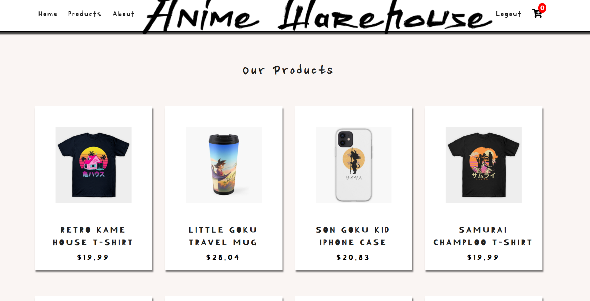
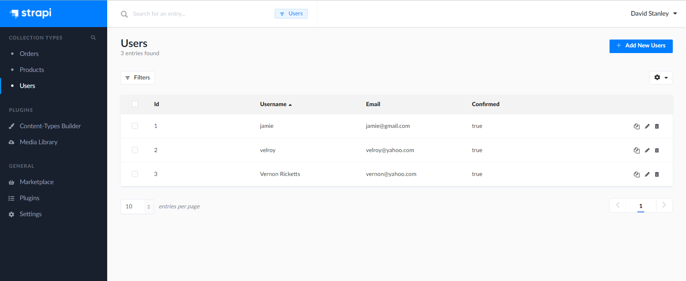

# svelte-ecommerce-app

I did this project because I wanted to build a fully functional e-commerce app to put in my portfolio. I read that e-commerce projects make portfolios look really good and I wanted the experience. This proect was challenging and I made many mistakes but I know that I'm a better software engineer because of it. I spent a month working on this project and it was tough but i'm so glad that I sucked it up and kept pushing through.
# Environment Setup
 
 1. Clone my repo at https://github.com/davidmstanleyjr/svelte-ecommerce-app

 2. CD into it and run "npm install" to install all of the dependencies.

 3. You're going to need to create your own Strapi app and deploy it to Heroku in order to have a functional backend. This project won't work without it.

 # Technologies used

 1. Javascript
 2. CSS
 3. Svelte 
 4. Postgres
 5. Heroku
 6. Svelte Router
 7. Axios
 8. Strapi 
 9. Cloudinary
 10. Stripe
 11. Node js
 12. Strapi Cloudinary uploader plugin
 13. Netlify

# Issues

I loved working on this project but I had a lot of issues. Figuring out the logic for all the moving parts of the application was really tough. I had to write logic for retrieving the products, adding them to the cart, increasing and decreasing the items in the cart and so much more. 

I had to use several technologies that i've never used before and that was hard. I had to use Stripe to handle the payments but implementing it was tough. I had to write logic for stripe in both my front end and backend. 

The toughest part was Strapi. Strapi allows you to build your own api and consume it in your project. Figuring that out was tough. I had to build a functional backend for development and then when I deployed, I had to use Strapi in an admin page and that caused me a lot of problems. 

I used my Strapi api to publish products while in development mode and that threw the ID's in my api off. 

When I finally deployed my front end, the images wouldn't show up on the page. The reason is because everything related to my products came from my api, only the logic came from my code and I wrote the code in such a way to connect the ID of the image src to the ID of the product being displayed on the page. So when I published products, everything came through accept for the images. The reason is because ID's were thrown off because I used my api incorrectly and publishing products from my development Strapi page instead of my Admin/production Strapi page, was the wrong thing to do. 

I had to store my images in Cloudinary because using Heroku for my deployed backend gave me the problem of my images being deleted once my app went to sleep. Heroku apps are only awake for a certain amount of time each day and I would lose my images during sleep time. So I had to use Cloudinary to store my images and use the strapi cloudinary npm package to make Cloudinary my default strapi image uploader. The images come from the Cloudinary url.

I would upload images through Strapi and I could see them on Cloudinary but they wouldn't display on the page. That's how I knew Cloudinary worked and the issue was a mistake on my end. I opened up the products page in the browser and saw that the ID's were off because of the mistake I made.

So I had to delete my backend and start from scratch (which took forever). I re-deployed to Heroku, published my products and everything worked fine. In Strapi I can see the registered users and their orders and in Stripe I can see the successful payments. I'm so glad I was able to get this application to work.

# Screenshots

# Live Page 

Here is the link to the deployed site. I hope you have fun with it.

https://anime-warehouse.netlify.app/

